# Typebot Community Edition Quick Deployment

> **Disclaimer:** This service is provided by a third party. We strive to ensure its safety, accuracy, and reliability, but cannot guarantee it is entirely free of faults, interruptions, errors, or attacks. Therefore, our company hereby states that we make no representations, warranties, or commitments regarding the content, accuracy, completeness, reliability, applicability, or timeliness of this service, and shall not be liable for any direct or indirect loss or damage arising from your use of this service; regarding third-party websites, applications, products, and services accessed through this service, we are not responsible for their content, accuracy, completeness, reliability, applicability, or timeliness, and you should bear the risks and responsibilities resulting from the use; we will not be liable for any losses or damages arising from your use of this service, including but not limited to direct losses, indirect losses, loss of profits, loss of goodwill, loss of data, or other economic losses, even if the company was previously notified of the possibility of such losses or damages; we reserve the right to modify this disclaimer from time to time, so please check this disclaimer regularly before using this service. If you have any questions or concerns about this disclaimer or this service, please contact us.

## Overview

Typebot is an fair source chatbot builder. It allows you to create conversational apps/forms (Lead qualification, Customer support, Product launch, User onboarding, AI chats), deploy it on your website or WhatsApp number, and collect results in real-time.You can create your own customized chatbot by configuring OpenAI's API key.

## Prerequisites

Deploying the Maybe community edition service instance requires access to and the creation of certain Alibaba Cloud resources. Therefore, your account needs to contain permissions for the following resources.  
**Note:** This permission is only required when your account is a RAM account.

| Permission Policy Name                        | Remarks                                              |
|-----------------------------------------------|-----------------------------------------------------|
| AliyunECSFullAccess                           | Permission to manage cloud server services (ECS)   |
| AliyunVPCFullAccess                           | Permission to manage Virtual Private Cloud (VPC)   |
| AliyunROSFullAccess                           | Permission to manage Resource Orchestration Service (ROS) |
| AliyunComputeNestUserFullAccess               | Permission to manage the user side of ComputeNest   |

## Billing Instructions

The costs associated with deploying the community edition in ComputeNest mainly involve:
+ The selected vCPU and memory specifications
+ The type and capacity of the system disk
+ Public network bandwidth

## Deployment Architecture

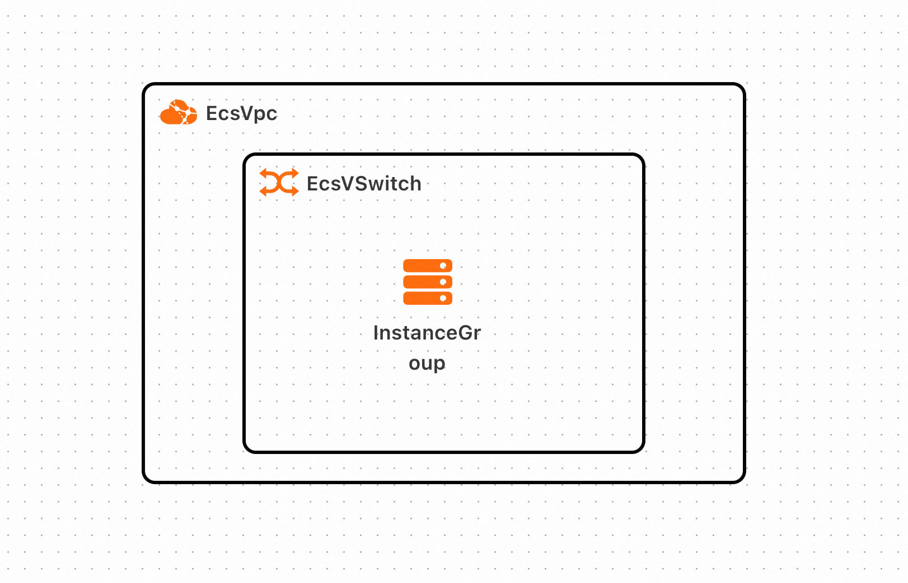

## Parameter Description

| Parameter Group                               | Parameter Item                                     | Description                                          |
|-----------------------------------------------|---------------------------------------------------|-----------------------------------------------------|
| Service Instance                              | Service Instance Name                             | Length not exceeding 64 characters, must start with a letter, can contain numbers, letters, hyphens (-), and underscores (_) |
|                                               | Region                                            | The region in which the service instance is deployed |
|                                               | Payment Type                                      | The billing type of the resource: pay-as-you-go or subscription   |
| ECS Instance Configuration                    | Instance Type                                     | Instance specifications available in the availability zone |
|                                               | Instance Password                                  | Length 8-30, must include three items (uppercase letters, lowercase letters, numbers, or special symbols from the set ()`~!@#$%^&*-+=|{}[]:;'<>,.?/)    |
| Network Configuration                         | Availability Zone                                 | The availability zone where the ECS instance is located |
|                                               | VPC ID                                           | The VPC where the resource is located               |
|                                               | Switch ID                                        | The switch where the resource is located            |

## Deployment Process

1. Visit Compute Nest [Deployment Link](https://computenest.console.aliyun.com/service/instance/create/default?type=user&ServiceName=Typebot%E7%A4%BE%E5%8C%BA%E7%89%88) and fill in the deployment parameters as prompted.
2. Fill in the instance parameters 
3. Choose to create a new dedicated network or directly use an existing dedicated network based on your needs. Fill in the availability zone and network parameters,
4. If you need to use GitHub OAuth login, you can enter your Client ID and Secret here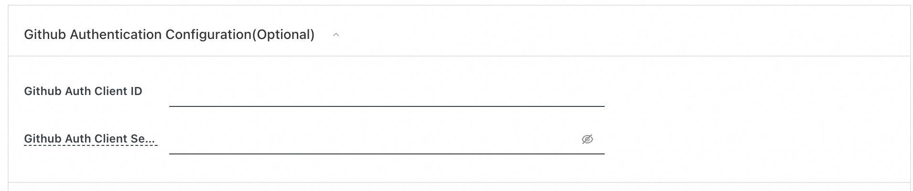. For more detailed information, please refer to the [GitHub Developer Documentation](https://github.com/settings/developers)
   . Then click "Next: Confirm Order"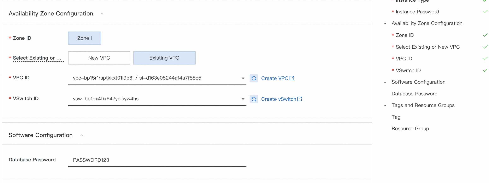
5. Click "Create Now" and wait for the service instance to be deployed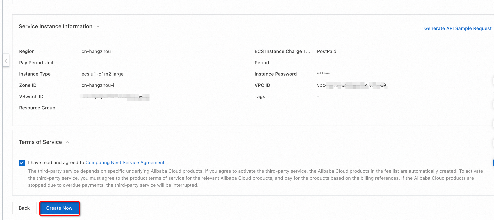
6. Once the service instance is deployed, click on the instance ID to access the details page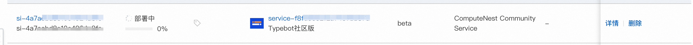
7. Access the service instance's usage URL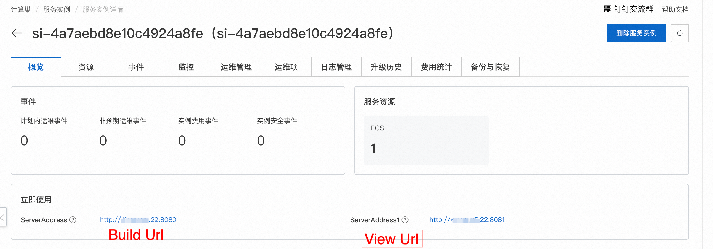
8. The application provides two ports: one for the chatbot usage interface (ending with port 8081) and one for the chatbot building interface (ending with port 8080).
9. Let's first enter the building interface to start creating your chatbot. Log in with your Alibaba Cloud account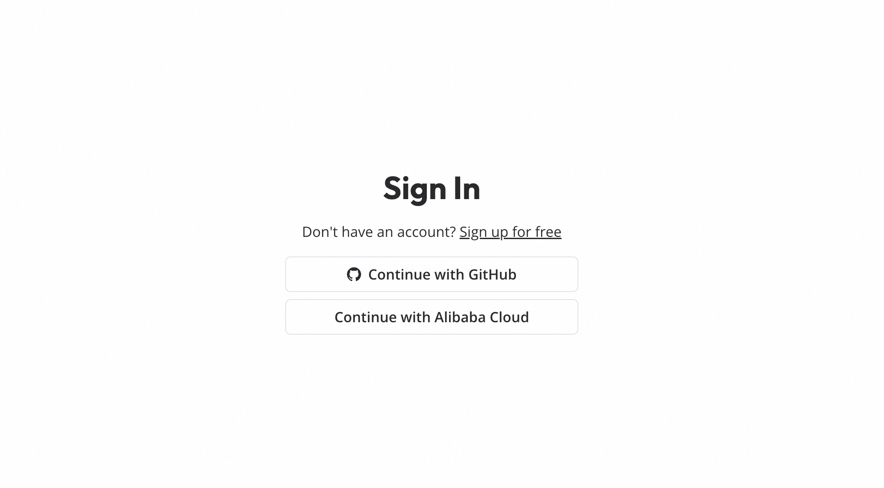
10. After logging in, you can create a chatbot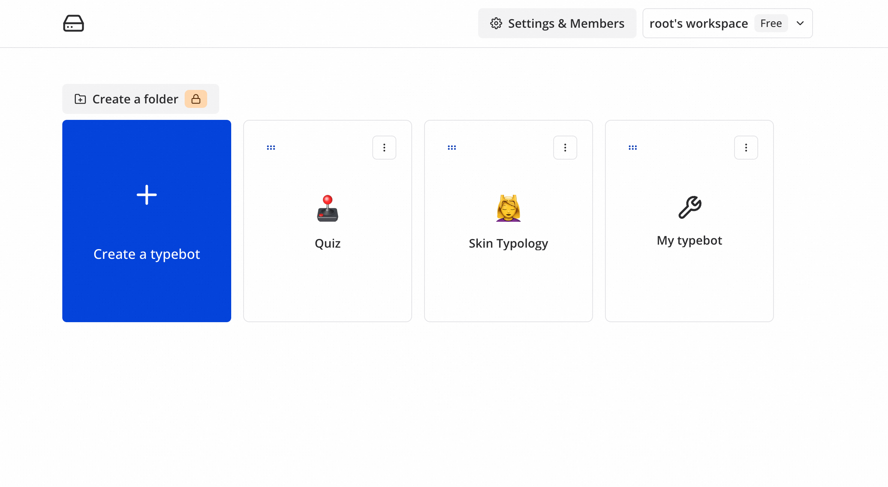
11. You can create a chatbot using one of these three methods. Here, we select the first template to create one. 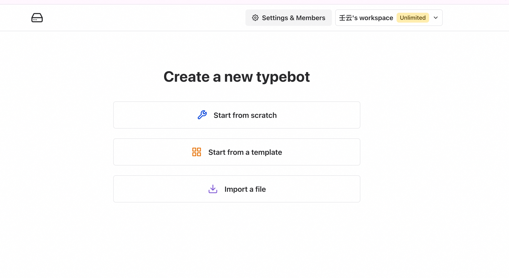
12. Then, select the first sample template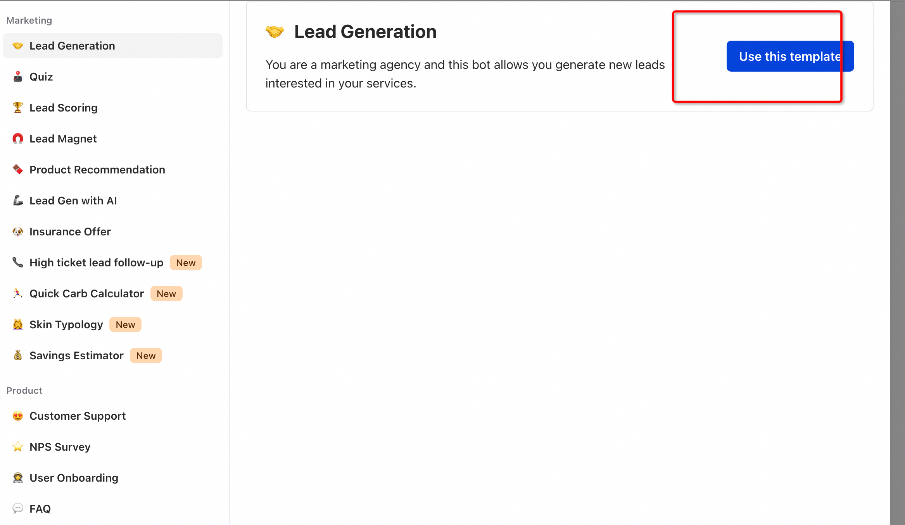
13. Click the "Publish" button in the upper right corner to publish. 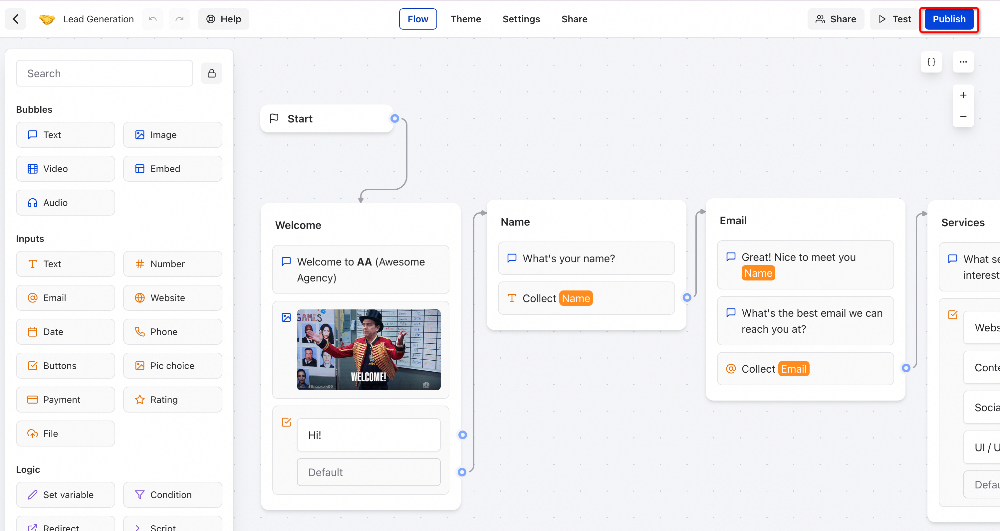
14. Copy the access link for the chatbot and paste it into your browser to access it. 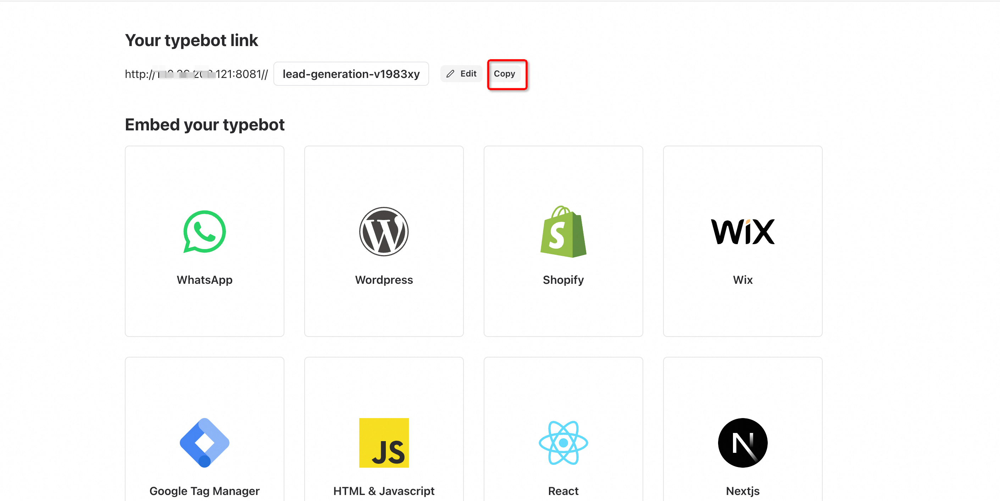
15. You can now chat with your chatbot! 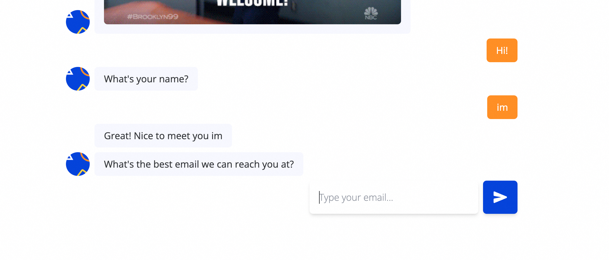

